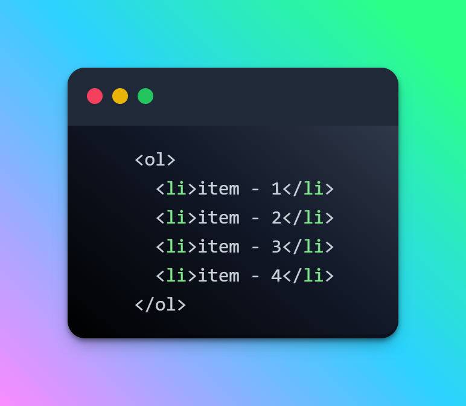
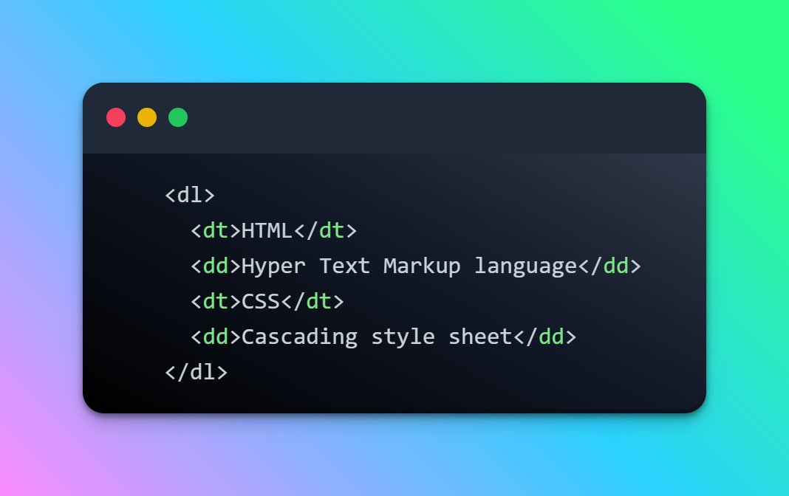
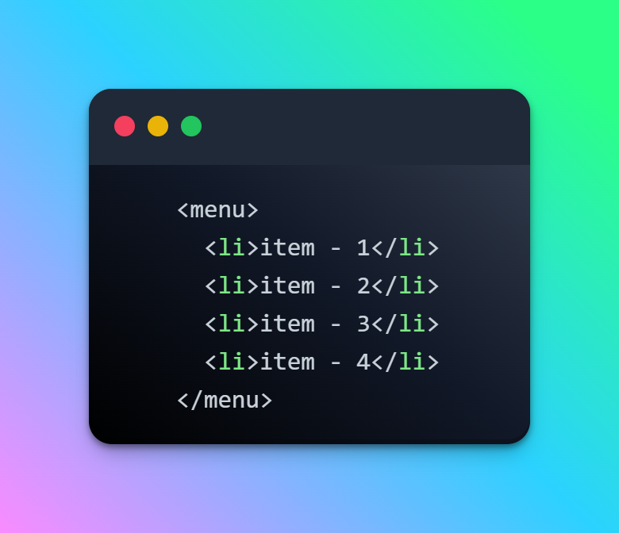

<h1 align="center"> 113 HTML elements commonly used in most websites </h1>

 

## ➊ Semantic elements
Elementos semânticos fornecem significado real e estrutura ao conteúdo. Eles descrevem o tipo de conteúdo que contêm, é útil para SEO e acessibilidade.
- < section >
- < nav >
- < header >
- < footer >
- < main >
- < aside >
- < article >
- < figure >
- < figcaption >

## ➋ Text-level elements
Os elementos de nível de texto são usados para manipulação e formatação de texto no documento.
- < h1 > ... < h6 >
- < p >
- < a >
- < em >
- < span >
- < strong >
- < sub >
- < sup > 

## ➌ Form elements
O HTML fornece vários elementos para criar formulários para entrada do usuário.
- < form >
- < input >
- < select >
- < textarea >
- < label >
- < button >
- < legend >
- < fieldset >

## ➍ Table elements
Os elementos da tabela são usados para criar tabelas na página da web.
- < table >
- < thead >
- < tbody >
- < tr >
- < th >
- < td >

## ➎ List elements
 Os elementos da lista são usados ​​para criar listas ordenadas e não ordenadas na página da web.
- < ul >
- < ol >
- < li >
- < dl >
- < dt >
- < dd > 

## ➏ Media elements
Os elementos de mídia são usados ​​para incorporar arquivos de mídia na página da web.
- < img >
- < audio >
- < video >
- < source >
- < track >

## ➐ Container elements
Os elementos de contêiner são usados ​​para agrupar e organizar outros elementos na página da web. 
- < span >
- < div >
- < header >
- < footer >
- < nav >
- < section >
- < main >
- < aside >

## ➑ Interactive elements
Elementos interativos (como eventos) fornecem interatividade na página da web. 
- < button >
- < input >
- < select >
- < meter > 

## ➒ Metadata elements
Os metadados fornecem informações adicionais sobre o documento e seu conteúdo.
- < title >
- < meta >
- < style >
- < script >
- < link > 

<h1 align="center"> Lists </h1>

 

## ➊ Unorder list

 
Uma lista não ordenada é uma lista com marcadores onde cada item é precedido por um marcador.

É criado usando o elemento < ul > e cada item da lista é definido usando o elemento < li > .

 

  

## ➋ Order list

Uma lista de pedidos é uma lista numerada onde cada item é precedido por um número.

É criado usando o elemento < ol > e cada item da lista é definido usando o elemento < li > .

 

  

## ➌ Data list

Uma lista de definições é uma lista que consiste em termos e suas definições correspondentes.

É criado usando o elemento < dl > , e cada termo é definido usando o elemento < dt > , enquanto cada definição é definida usando o elemento < dd > .

 

  

## ➍ Menu list

 A lista de menus é usada para criar uma lista de opções de menu. Ele é criado usando o elemento < menu > e cada item é definido usando o elemento < li > .

 

  

